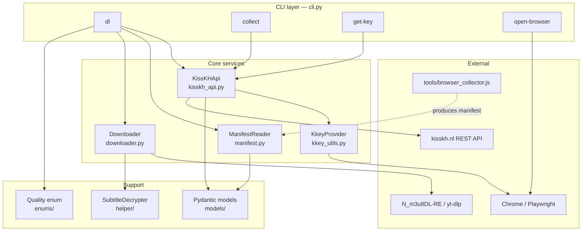
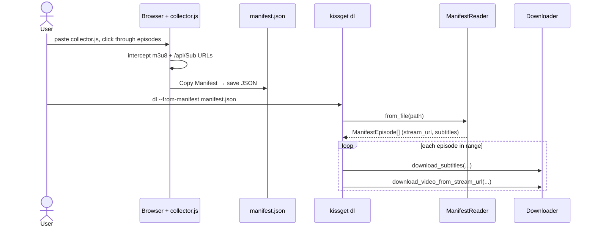
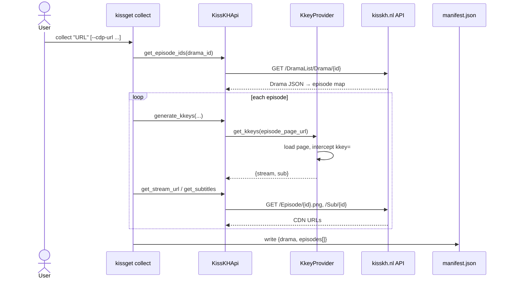
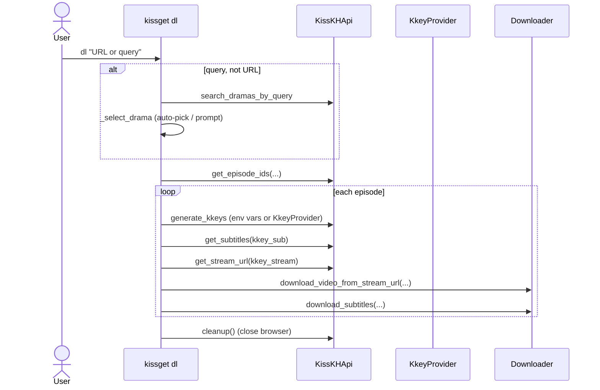
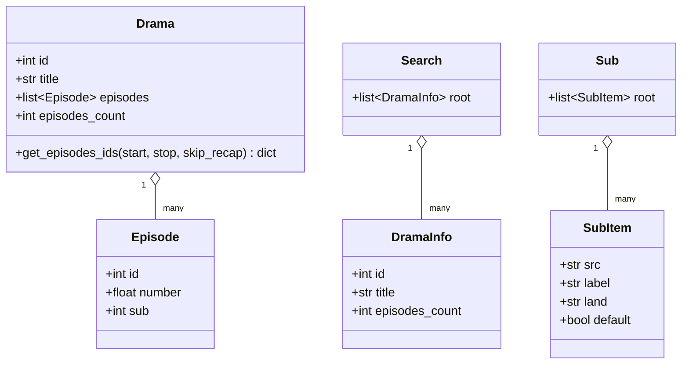
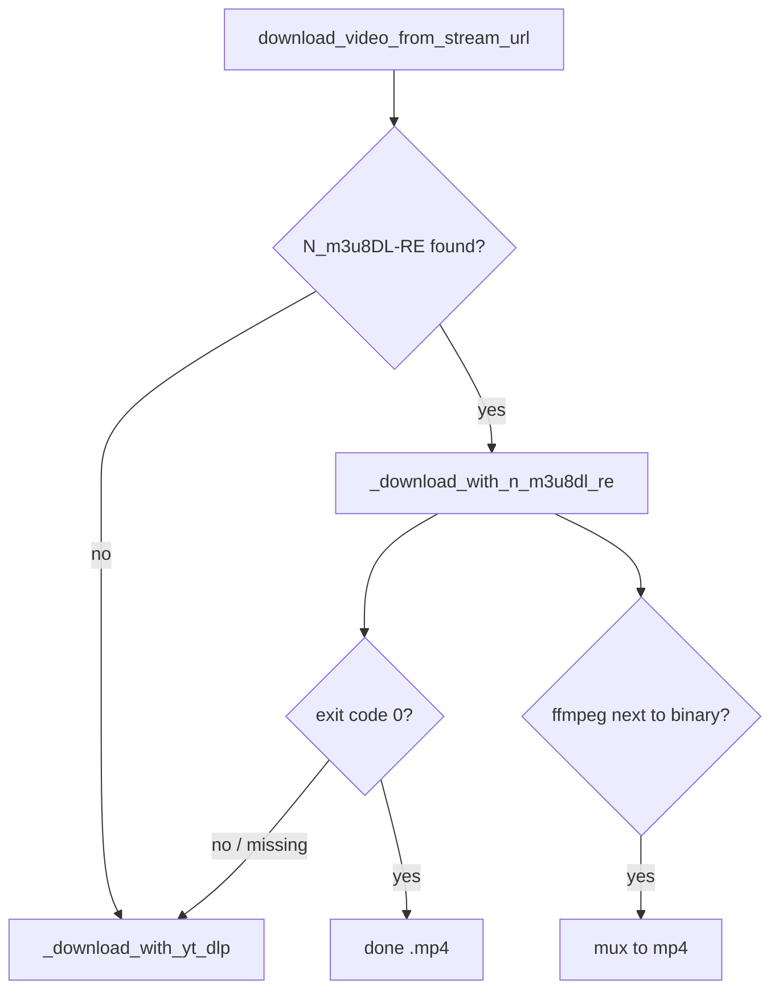

# Architecture

This document explains how **kissget** is structured internally: the layers, how
they fit together, and the three download workflows the tool supports. It is aimed
at contributors and maintainers. For end-user instructions, see the
[README](../README.md).

## Contents

- [High-level overview](#high-level-overview)
- [Module map](#module-map)
- [The kkey problem](#the-kkey-problem)
- [Workflow A — Manifest (kkey-free)](#workflow-a--manifest-kkey-free)
- [Workflow B — `collect` CLI](#workflow-b--collect-cli)
- [Workflow C — Direct API download](#workflow-c--direct-api-download)
- [Data models](#data-models)
- [Authentication internals](#authentication-internals)
- [Download backends](#download-backends)
- [Configuration & environment](#configuration--environment)
- [Design notes](#design-notes)

---

## High-level overview

kissget is a Python CLI built on [Click](https://click.palletsprojects.com/). It
downloads dramas from **kisskh** (`kisskh.nl`/`kisskh.co`), whose stream and
subtitle APIs require a short-lived `kkey` token, and from **AsiaFlix** via the
collector/manifest path. The architecture is organised around two ideas:

1. **Isolate each site behind a provider.** Everything site-specific — URL shape,
   search, auth, stream/subtitle resolution — lives in a `SiteProvider`
   ([`providers/`](../src/kissget/providers/)), so the rest of the pipeline (fetch
   metadata → resolve stream URL → download) is site-agnostic.
2. **Isolate the auth problem.** For kisskh that means the `kkey` token; the
   manifest path sidesteps auth entirely by capturing resolved CDN URLs.



---

## Module map

| Module | Responsibility |
|---|---|
| [`cli.py`](../src/kissget/cli.py) | Click command group and all four subcommands (`dl`, `collect`, `get-key`, `open-browser`). Argument parsing, episode-loop orchestration, filename construction. Resolves a **provider** per URL/site and delegates all site-specific work to it. |
| [`providers/`](../src/kissget/providers/) | `SiteProvider` interface + registry (`get_provider`). Everything site-specific — URL parsing, search, auth, stream/subtitle resolution — lives behind this. `KisskhProvider` covers `kisskh.nl`/`kisskh.co` (wraps `KissKHApi`); passing a site URL auto-targets that domain. |
| [`kisskh_api.py`](../src/kissget/kisskh_api.py) | `KissKHApi` — HTTP client for the kisskh REST API. Builds endpoint URLs, sends requests with browser-like headers, parses responses into models, and delegates kkey generation to `KkeyProvider`. Used by `KisskhProvider`. |
| [`kkey_utils.py`](../src/kissget/kkey_utils.py) | `KkeyProvider` — drives a browser (CDP or Playwright) to load an episode page and intercept `kkey` tokens from outgoing network requests. |
| [`manifest.py`](../src/kissget/manifest.py) | `ManifestReader` / `ManifestEpisode` — parse a collector-produced JSON manifest into episode objects for the kkey-free path. Site-agnostic; an optional `site`/`referer` sets the download Referer (e.g. AsiaFlix). |
| [`downloader.py`](../src/kissget/downloader.py) | `Downloader` — downloads video (via N_m3u8DL-RE, falling back to yt-dlp) and subtitles, with optional decryption. Auto-detects binaries and detects network/ISP blocks. Site-agnostic. |
| [`models/`](../src/kissget/models/) | Pydantic models: `Drama`/`Episode`, `Search`/`DramaInfo`, `Sub`/`SubItem`. |
| [`helper/`](../src/kissget/helper/) | `SubtitleDecrypter` + `AESCipher` for decrypting encrypted `.srt` subtitles. |
| [`enums/quality.py`](../src/kissget/enums/quality.py) | `Quality` enum (`360p`–`1080p`). |
| [`tools/browser_collector.js`](../tools/browser_collector.js) · [`asiaflix_collector.js`](../tools/asiaflix_collector.js) | Browser-side DevTools scripts that capture CDN URLs and export a manifest — one per site. The most reliable auth path — see Workflow A. |

---

## The kkey problem

Every protected kisskh API call (`/api/Sub/...`, `/api/DramaList/Episode/...`)
requires a `kkey` query parameter — a hex token that the site's frontend computes
and that **expires within seconds**. This single constraint shapes the whole
design. There are three strategies, in decreasing order of reliability:

1. **Capture finished CDN URLs from a real browser** (Workflow A) — sidesteps
   kkeys entirely, because the resolved m3u8/subtitle URLs no longer need them.
2. **Drive a browser to mint kkeys on demand** (Workflows B & C) — works, but the
   browser may be bot-detected, and tokens can expire mid-batch.
3. **Supply pre-generated keys** via `--stream-key`/`--sub-key` or
   `KISSKH_STREAM_KEY`/`KISSKH_SUB_KEY` — fastest, but you must refresh them when
   they expire.

---

## Workflow A — Manifest (kkey-free)

The recommended path. The browser collector script captures already-resolved CDN
URLs from inside your own browser session; the CLI then downloads straight from
the manifest with no API calls and no kkeys.



Code path: [`cli.py:212`](../src/kissget/cli.py#L212) (the `if from_manifest:`
branch) → [`ManifestReader.from_file`](../src/kissget/manifest.py#L58) →
[`Downloader`](../src/kissget/downloader.py#L49). Note this branch never
constructs a `KissKHApi`, so no browser or token is involved.

---

## Workflow B — `collect` CLI

Automates manifest building from the command line. It visits each episode page
(via Playwright or your real Chrome over CDP), mints kkeys, calls the API to
resolve stream/subtitle URLs, and writes a manifest — which you then feed to
Workflow A.



Code path: [`cli.py:454`](../src/kissget/cli.py#L454) (`collect`).

---

## Workflow C — Direct API download

The simplest to invoke but the most fragile: `dl <URL>` resolves episodes and
downloads in one pass, minting kkeys per episode via Playwright. Because tokens
expire fast, `--subs-first` exists to download all subtitles in one pass before
the videos.



Code path: the `else` branch at [`cli.py:252`](../src/kissget/cli.py#L252)
onward, with the `subs_first` split at [`cli.py:308`](../src/kissget/cli.py#L308).

---

## Data models

All API responses are validated with Pydantic v2. Field aliases map the site's
camelCase JSON to snake_case Python attributes.



- `Drama.get_episodes_ids()` is the central range/recap filter, returning an
  ordered `{episode_number: api_id}` map consumed by every workflow.
- `Search` and `Sub` are `RootModel` wrappers that behave like lists
  (`__iter__`/`__getitem__`/`__len__`).
- `land` (not `lang`) is the site's own field name for subtitle language;
  `ManifestReader` maps the manifest's `"lang"` key onto it.

---

## Authentication internals

`KkeyProvider` ([`kkey_utils.py`](../src/kissget/kkey_utils.py)) has two modes
and a shared, lazily-created browser context (class-level state so a single
browser is reused across an episode batch):

- **CDP mode** (preferred) — `connect_over_cdp(cdp_url)` attaches to your real
  Chrome/Edge launched by `kissget open-browser`. Uses your genuine fingerprint
  and cookies, so it is not bot-detected. On cleanup it *disconnects* without
  closing your browser.
- **Playwright mode** (fallback) — launches a managed Chromium with
  `--disable-blink-features=AutomationControlled` and optional
  `playwright-stealth`. Currently detectable by kisskh.nl.

In both modes, `get_kkeys()` registers a `request` listener that scrapes the
`kkey=` hex out of any URL matching `/api/Sub/` (→ `sub`) or
`/api/DramaList/Episode/` (→ `stream`), attempts to auto-click the play button,
and polls until both keys are captured or the deadline passes.

`KissKHApi.generate_kkeys()` short-circuits this entirely when both
`KISSKH_STREAM_KEY` and `KISSKH_SUB_KEY` are set, and fills in only the missing
key when one is supplied.

---

## Download backends

`Downloader.download_video_from_stream_url()` picks a backend at runtime:



- **N_m3u8DL-RE** (preferred) — multi-threaded HLS downloader. Auto-detected from
  `PATH` and well-known dev locations ([`downloader.py:16`](../src/kissget/downloader.py#L16)).
  If `ffmpeg` sits next to it, output is muxed to MP4. Skips files already
  downloaded.
- **yt-dlp** (fallback) — single binary dependency, always available. Selects
  format by `quality` height.

`_normalize_stream_url()` downgrades `https://` → `http://` for non-kisskh CDN
hosts, working around CDNs that serve plain HTTP on port 443 (the
`WRONG_VERSION_NUMBER` SSL error noted in the README troubleshooting).

Subtitles are fetched with `requests`, written as `<file>.<land>.<ext>`, and
optionally run through `SubtitleDecrypter` (AES via the `cryptography` package +
`pysrt`).

---

## Configuration & environment

| Variable | Used by | Purpose |
|---|---|---|
| `KISSKH_BASE_URL` | `cli._resolve_base_url`, `KissKHApi` | Override site base URL. |
| `KISSKH_STREAM_KEY` / `KISSKH_SUB_KEY` | `cli.dl`, `KissKHApi.generate_kkeys` | Skip browser kkey generation. |
| `KISSKH_KEY` / `KISSKH_INITIALIZATION_VECTOR` | `cli.dl` | Subtitle decryption key + IV. |

Secrets resolve in the order **CLI flag → environment variable → default**, with
`python-dotenv` loading a `.env` at startup ([`cli.py:19`](../src/kissget/cli.py#L19)).

---

## Design notes

- **Sites are isolated behind providers.** `cli.py` resolves a `SiteProvider`
  from the URL host (or defaults to kisskh) and delegates all site-specific work
  to it. Adding a site means adding a provider and/or a collector — the download
  pipeline, manifest, and models don't change. `KisskhProvider` wraps the
  existing `KissKHApi`/`KkeyProvider` unchanged.
- **The manifest format is site-agnostic.** It carries only `stream_url` +
  subtitle URLs (plus an optional `site`/`referer`), so `dl --from-manifest`
  works for any site whose collector emits it — which is why AsiaFlix needs no
  live-API adapter.
- **Auth is isolated by design.** `KkeyProvider` is the only browser-aware
  component; everything downstream operates on plain URLs. The manifest workflow
  exploits this by skipping the provider altogether.
- **Lazy browser loading.** `KissKHApi.kkey_provider` is a lazy property and
  Playwright is imported on first use, so manifest-only and env-var users never
  pay the browser import cost.
- **Resilience over correctness.** The episode loops catch per-episode
  exceptions and continue, so one failed/unreleased episode (`tickcounter`
  sentinel) doesn't abort a batch.
- **Path safety.** `_sanitize_path_component()` strips separators and `..` to
  prevent path traversal from drama titles used in output paths.
```
